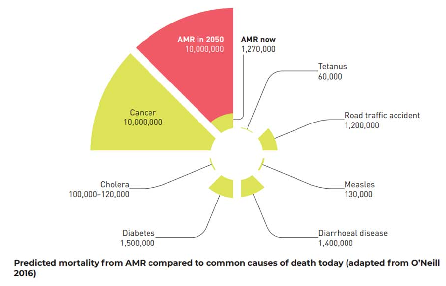

---


## Introduction
Antimicrobials – including antibiotics, antivirals, antifungals and antiparasitics – are medicines used to prevent and treat infections in humans, animals and plants. Antimicrobial Resistance (AMR) occurs when bacteria, viruses, fungi and parasites change over time and no longer respond to medicines making infections harder to treat and increasing the risk of disease spread, severe illness and death. As a result of drug resistance, antibiotics and other antimicrobial medicines become ineffective and infections become increasingly difficult or impossible to treat.



<center>
<a href="https://www.gavi.org/vaccineswork/what-antimicrobial-resistance-and-how-can-we-tackle-it?gclid=CjwKCAjwo7iiBhAEEiwAsIxQEe9oBkLiHuUFI8ru5pDI6lSTsba_wHPjZBYob6fX-YYfKzztvWuvEhoCdtUQAvD_BwE">Image Source: Gravi.org</a>
</center


## AMR in Agriculture


## Material and Methods
### Data
#### Data Processing
### Flowchart

<iframe frameborder="0" style="width:100%;height:900px;" src="https://viewer.diagrams.net/?tags=%7B%7D&highlight=0000ff&edit=_blank&layers=1&nav=1#R7VzZctu4Ev0aVyUPUnERZenR8nYzYyeZyNmepiASonBNEgxAbfn6aSzcKUuiRdv31iSVhGhi7T7oPmjQObMvw80tQ%2FHinno4OLMMb3NmX51Z1vh8CH8LwVYJhqatBD4jnhKZuWBKfmMtNLR0STzMSxUTSoOExGWhS6MIu0lJhhij63K1OQ3Ko8bIxzXB1EVBXfqdeMlCSR1jnMv%2Fg4m%2F0COfO3reIUrragFfII%2BuCyL7%2Bsy%2BZJQm6incXOJAqC5Vy%2FcP2%2B%2FB3ePw9o%2B%2F%2BC%2F0dfLnw8dvPdXZzTFNshUwHCWtu%2Bb3t9bdx6m5daLf9%2F4fFwtrfaWbGCsULLW6zqxhAINMPLKCR188pqJZKriOVoTRKITpIDHEFUpQWgkmMKs2BFlDd1Jk8GSrLTX8tRSqnMxplPS4xNEFVBjFG9VIv652I6o%2Fp5933xAjaAaNrUuodkmDZRhxVXjYxvh9YRVqrOcs7vnrMK0dC5kmDKMQatwEAFM5f0v94%2FJV%2B0WceJZfEInmSCDzjU7wAYcxZihZMo2IQds5WqV5WOA%2FYvEI%2BxjWjwPqMzCXPYHRSIgTzKrvPucvJusFSfA0Rq7oYQ2OGmSLJAygZIrFkQ1Ofa8qBwEgmTI5tD2fzy3XBTlPGH3EhTfecDZ0htl09%2FoY7YtWmCV4U3Cw2ufcYgozZluokr7VLkZHD0eV1rkntmxdY1HywjoAaOfvZ%2F3mHg4etJM7wuFZrRyecnDGd4YiPyCR35mzM80TebudHX3lAGvjM4o80C1EdbWyOcANy%2BjKRO%2FbyF2Agye%2F5VpFaE5ItKRL0QJawt8RjXolseiI44T34VmNQeci1AOCexyAjGVb32fYR4nqdr6M3IRQ4WxP6GFfXKMZWljDxLuMGDxGUWOTGXIffUaXkQc2kltdLIBEJCEQr1t1eagyPi2TeJlk1l8QLrvDMZe7Xm5QgRuIAhIQUrDSEZjLWYrGEa5jc03AZUBnqiSAJfoVePtWai9XGQgXtEArhTQeCq%2FKCs0K05mJ7hB4NGCCAO0bdxkuA5SIZ2CqsDAUCm8bzXgsF2qISa0xfsw2Q7KgEvHZeC5FjJfGUzGE9HFfPYWUyVUspL7zHi8r8%2FIITzeNnNxaOslsblpT6WxclzIPphBshVpuSFSgZwU9Fq0g6n2YaL7DUwoxzyiEVowYrxoYWSmUJ1SRQZgxp8FKThEeiCdU%2Fe5hOn1frseXPMaR11BPzP2ByLkGsHhZww0IEHJcAcu7fAqpKfJJvm8yndQ6CjiVUHGDpZpAbphVxgaNs2vrbGScjS8FJfgbppIKrjJPqRWfvhiR9GlcsaOYV7orao0gqqbN%2BgUnoTZjzXc0iRt9z1NkRHoH7Gm6sJddlNmEI343sYmh%2FKXdRUGufin%2F4gI%2B7%2FBcBHqzIPqig7%2BUdUVGrFGZjZw30BGrgY7YnfEReycfyYjFR7zON%2FGN2sRPWD1rJ7ZQFnkjsZ%2FFnpfKylxbpRu8AoXzoidTeytZNIwpuKqkp7y60dTekI1SsEvgbzFi%2Ffqu3MGThfufJlR6n%2BcSYA%2Fh0byRAA%2FdEZ7NxRvd2Hg5MmydG3X8GQ34G3UGP7Omfuz5eKqLlEFo8ymEketcOsl9h9BVXueO0lir%2F784SbbaHGgJUCsZC29I8kM07zu69LPw5mqje5aFbVqIYL0%2FioWfeQ%2BimDeTpbTdcabkdMlc%2FITCtCESxHycPFHvXNUTynwSGAwD1SCrcq6qycy66WdKJF3VgBqWAWWfj8s9qHnqRjlWLhhD20K1WFTgu4exm4e5Oaz6QMM3B6oaP4dtppD2SHYaHGkV2UFAYn6AM0HATGQmUnqVhgA4cnHzcXo2cgbOC3oQezSqeZDBoO5AUtnJHciw1Xl6mgDoeUJcyQQvwHdsOeFNQUxEPsxdRmK5Sywja8p3MZ3a8JIZHlhXh9lvhC9RQH4jcT49mlIZR1Mqz8Ejb9CEqJE1s4ddJmjGFUQN65zIdBpiUtru5JA637%2BT2YKGsyVvz1x38tOdjLYr9Vc8uGPUKcGwQfvDrrQ%2FfnpDN2Ub4MyJWTHTAGeod71eUf7%2B6czJifvVmzj3K2nu4B65CyJPzHdARSNFcfWN16kyeidQB%2Buo45deCEkFlwHiMjkTzlCAIldYQNoFb0SkxUX%2FnDXqCRPGsczkTO8%2FPVzL44hPGdgyfE3bvI5SP19e6FMbbGBwQmQuFMOJH5E5BFLJv4pHMpVJU4cwH2KnKOkk7Zl98y%2B2W44nEakcRw3mP24nlHJhCHUC%2FoJ9hjkvUwiyb%2BYnpBVvMN6Nq2eDerwbmA0Bzxx0dQY2d1%2BCx43gCeFQRaJeIk67AjpGrJmqfjGjSULD5neBzHzJN7A%2F5RuPMCzvQZQ8SJiSLyPiQmjqzYhH1CsczuRxRKgLgNqbMYwe1auIsnBPbj%2BLaxf3X6DFDYVhEU8OD4JxNxh9xcPUyOw7JTgOBw0ZGev8BfmXPTjgIBt5F%2BLLGCi5IrISt6zhsjnyzEmeLPlZypU0Z07aZGmOs9TebIsmo3uzLekW3ptuWRe%2FAKpbNZU9MytjG5U0s13xXWrhtbRMrSOnmt8ZH5bfOVVSxW463r8yGE2zgEajPx6PnkSkKBQ%2BpOgCpfaBKHXeFEidSippYFew1Rqko5cF6cDaD9L0ToGE6jahgE8RLkQi6g7NcPCZcqJC8VUaxbMKFwFwbXgh4%2F5E9nSRJgobs4Z6MBjUF9fKAQHEgQZubuHs%2BbdpjTbwpx%2BL8NtNeBs4FQuPG4Kb03cawpt9gvD2l2f%2F%2BmGN%2BKrHjO3k6ufgfvOt4b7rgoszDMi%2BRuTXUpxWPlylB50pCmNxFbvDmgu8Qb4wVukbKi3NNr11CCUp3x51ZZHq%2FeOB149OV9Y4JGn%2Bf8I19npnq9E7l93%2Fbki%2FGtWoIqol06j2M6z0czof3qjDA3K%2BrYE4duyz8pWhcb4PjqJUZQ05Rg3DKnGQ4eC1KYh1IMjtN0VBavfh45borWbRrWqyoGP4NiXNnwdfjTWzb1iDEtYGCs1Hge1t3Z3XPOxe1A5fE6SDCokyWmK0es9W9dSng%2BiXP1afHu%2B2H%2F3V6M9ROL0ldz8%2BtfxJjwlyAUZE3KY844c8OvtsNf9y0Wn6SL%2Fdl3K7tbK36Q6e%2Bpa%2F%2BK%2BR10M3%2FKGfKDQdOrr65L8R%2BWYr5J%2FwZ5yO%2FzmjF99IH5cJI%2BrbPzEf%2B9Dd9O8G2L8BzPPBK%2B%2BApo9Md9OTSHxT%2FgQ32RHF2yrthahmJReSnbOPpprVpEqln47D%2BHG3A%2FtMmdHMEsVMj%2BBPHbtbmv8Almi8KkyM5uD1P4aS4%2FI6nW74ssV3U9O3YnFzdCKTm9Ucasc2P%2B6q5lDPINIn5QPo0Gp74dIdgl43tFQQlH3V%2F1wE1WJUxwjqLgnXy3JmefLBdPalHxqzcM%2BE0mFp4LfCUkzbagclc7AHk62hBMX8v7xQ1fP%2FNsS%2B%2Fgc%3D"></iframe>


### Analysis
#### Machine Learning Models

```python
# Code to show here
import pandas as pd
GitHubPages::Dependencies.gems.each do |gem, version|
  s.add_dependency(gem, "= #{version}")
end
```

[#View full code for XGBoost Regessor](./another-page.html).
[#View full code for Linear Regression](.Notebooks/Term Project LR.ipynb).


## Results and Discussion


| head1        | head two          | three |
|:-------------|:------------------|:------|
| ok           | good swedish fish | nice  |
| out of stock | good and plenty   | nice  |
| ok           | good `oreos`      | hmm   |
| ok           | good `zoute` drop | yumm  |

### There's a horizontal rule below this.

* * *

### Here is an unordered list:

*   Item foo
*   Item bar
*   Item baz
*   Item zip

### And an ordered list:

1.  Item one
1.  Item two
1.  Item three
1.  Item four

### And a nested list:

- level 1 item
  - level 2 item
  - level 2 item
    - level 3 item
    - level 3 item
- level 1 item
  - level 2 item
  - level 2 item
  - level 2 item
- level 1 item
  - level 2 item
  - level 2 item
- level 1 item

### Small image


### Large image


### Definition lists can be used with HTML syntax.

<dl>
<dt>Name</dt>
<dd>Godzilla</dd>
<dt>Born</dt>
<dd>1952</dd>
<dt>Birthplace</dt>
<dd>Japan</dd>
<dt>Color</dt>
<dd>Green</dd>
</dl>
   

```
Long, single-line code blocks should not wrap. They should horizontally scroll if they are too long. This line should be long enough to demonstrate this.
```

```
More Notes May be ?
```


    

